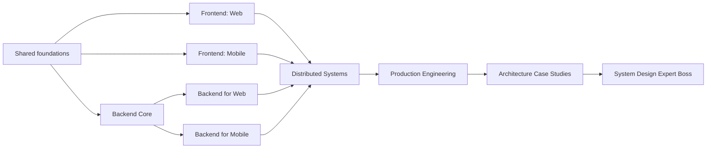

# SystemQuest Product and Implementation Blueprint

> Status: product direction agreed; implementation has not started.
>
> Purpose: this document is deliberately self-contained. Copy it into a new repository to begin implementation without needing the original DroidQuest repository or the conversation that produced the plan.

## 1. Product summary

**Working name:** SystemQuest

**Product:** A local-first, gamified application that teaches system design from computing fundamentals through frontend, backend, distributed systems, production engineering, and architecture defense.

**Core promise:**

> Learn to trace systems, estimate their limits, understand their failures, choose defensible trade-offs, and communicate designs clearly.

SystemQuest is not primarily an interview-answer library and should not teach learners to reproduce one canonical “Design Twitter” diagram. It should build transferable engineering judgment through short lessons, interactive traces, failure scenarios, design artifacts, quizzes, practical challenges, cumulative checkpoints, and capstones.

The app should be accessible to learners with little professional experience while remaining valuable to experienced frontend, mobile, backend, and platform engineers.

## 2. Product principles

1. **Concepts before frameworks.** Teach stable system concepts first, then provide optional technology-specific examples.
2. **Trace before memorization.** Learners should follow requests, events, data, and failures through a system.
3. **Trade-offs, not recipes.** Every architecture choice must be connected to requirements, constraints, failure modes, cost, and operational consequences.
4. **Extensive catalog, personalized route.** The full curriculum is large, but learners follow a relevant 48–56 module path rather than one mandatory 88-module line.
5. **No permanent track lock-in.** A learner may complete every pathway. Selecting a primary track changes recommendations, not access rights.
6. **Local-first learning.** Lessons, quizzes, challenges, search, glossary, revision, and normal progression work offline.
7. **Content is data.** Curriculum content is immutable, versioned, schema-validated, searchable, and separate from mutable learner progress.
8. **Transparent assessment.** Open-ended designs use visible rubrics. Optional AI feedback must explain its reasoning against those rubrics.
9. **Mastery differs from completion.** Finishing a lesson is not the same as retaining or applying the skill.
10. **Portfolio-producing practice.** Larger challenges create diagrams, contracts, estimates, ADRs, threat models, and incident analyses that learners can retain.
11. **Accessibility is foundational.** It is part of frontend architecture, interaction design, assessment, and the app itself.
12. **No punitive engagement mechanics.** Avoid hearts, energy gates, fabricated streaks, and mechanics that discourage deliberate learning.

## 3. Audience and learner outcomes

### Primary audiences

- Beginners who need computing and networking foundations before system design.
- Frontend web engineers who want whole-system understanding.
- Android, iOS, and cross-platform mobile engineers.
- Backend engineers designing browser-facing or mobile-facing services.
- Full-stack engineers moving toward senior or staff-level architecture work.
- Interview candidates who want genuine competence rather than memorized templates.

### Exit outcomes

A successful learner can:

- Clarify functional and non-functional requirements.
- Estimate traffic, storage, bandwidth, latency, and cost orders of magnitude.
- Design client, API, data, asynchronous processing, and delivery boundaries.
- Compare storage, caching, communication, and consistency options.
- Reason about retries, duplication, ordering, partial failure, and overload.
- Design appropriate web and mobile client behavior.
- Design backend services for web and mobile delivery constraints.
- Threat-model a system and describe privacy boundaries.
- Define SLOs, telemetry, rollout, recovery, and migration plans.
- Explain trade-offs and defend a design under changing requirements.

## 4. Curriculum topology

The curriculum is a prerequisite graph with branches and convergence points.



Backend for web and backend for mobile are extensions of one Backend Core. Databases, caching, queues, authentication, and service architecture must not be duplicated into two artificially separate backend curricula.

### Route behavior

- All learners begin with an optional diagnostic.
- The diagnostic can mark foundation competencies as demonstrated; it does not grant XP or badges without assessment evidence.
- Learners choose a primary craft: web frontend, mobile frontend, backend for web, backend for mobile, or full-stack.
- The primary craft changes the recommended next module and home-screen emphasis.
- It never locks other tracks.
- Each route contains small “literacy bridges” from adjacent tracks before distributed-systems content.
- All routes converge on distributed systems, production engineering, and architecture defense.
- A personalized core route should take approximately 48–56 modules.
- The complete catalog contains 88 modules for learners who want every specialization.

## 5. Curriculum scale target

| Region | Modules | Typical lessons per module |
|---|---:|---:|
| Shared engineering and design foundations | 12 | 4–6 |
| Frontend systems: web | 12 | 4–6 |
| Frontend systems: mobile | 12 | 4–6 |
| Backend core | 16 | 4–6 |
| Backend for web | 4 | 4–6 |
| Backend for mobile | 4 | 4–6 |
| Distributed systems | 16 | 4–6 |
| Production mastery and case studies | 12 | 4–6 |
| **Complete catalog** | **88** | **approximately 440 lessons** |

Complete-catalog targets:

- Approximately 440 focused lessons.
- One lesson quiz and one practical challenge per lesson.
- 88 cumulative module checkpoints.
- 15–20 region bosses and capstones.
- 500 or more glossary terms.
- 40–60 interactive architecture and incident scenarios.
- A recommended pace of 6–10 learner-directed hours per module.
- Core authored teaching segments capped at approximately 10 minutes; assessment, recall, labs, challenges, and optional reading are separate.

## 6. Complete curriculum map

Each numbered item below is one module, normally delivered as one week of structured learning.

### Region 1: Shared Engineering and Design Foundations — 12 modules

1. **Programs and machines:** programs, processes, threads, memory, files, terminals, operating systems, and resource ownership.
2. **Internet journey:** packets, IP, routing, ports, DNS, TCP, UDP, QUIC, TLS, connection establishment, and network failure.
3. **Application protocols:** HTTP semantics, APIs, headers, cookies, JSON, Protobuf, compression, status codes, and request lifecycles.
4. **Engineering workflow:** Git, debugging, logs, tests, dependency management, automation, and a small client-server capstone.
5. **Data models:** entities, identifiers, relationships, serialization, validation, schema evolution, and compatibility.
6. **Relational foundations:** SQL, constraints, indexes, query plans, transactions, isolation, locks, and migrations.
7. **Storage landscape:** documents, key-value stores, wide-column databases, graphs, object storage, and search indexes.
8. **Concurrency foundations:** asynchronous work, race conditions, queues, cancellation, resource bounds, and backpressure.
9. **Requirements:** actors, use cases, product constraints, functional requirements, non-functional requirements, risks, and assumptions.
10. **Estimation:** traffic, concurrency, throughput, latency budgets, storage, bandwidth, cache size, headroom, and cost orders of magnitude.
11. **Contracts and boundaries:** API contracts, data ownership, client/server boundaries, compatibility, error models, and dependency direction.
12. **Design communication boss:** context diagrams, container diagrams, sequence diagrams, data-flow diagrams, ADRs, trade-off tables, and a first design review.

### Region 2: Frontend Systems — Web — 12 modules

1. **Browser architecture:** navigation, parsing, event loops, rendering, storage, workers, processes, and security boundaries.
2. **Interface foundations:** semantic HTML, CSS layout, responsive design, input modes, internationalization, and accessibility.
3. **JavaScript and TypeScript runtime:** values, modules, events, promises, scheduling, workers, memory, and failure handling.
4. **Component architecture:** component boundaries, state ownership, derived state, effects, composition, and lifecycle.
5. **Design systems:** tokens, primitives, components, variants, theming, documentation, compatibility, and governance.
6. **Application flows:** routing, forms, validation, authentication, permissions, navigation state, and recovery.
7. **Server state:** fetching, caching, invalidation, deduplication, optimistic updates, consistency, and error presentation.
8. **Advanced delivery:** pagination, uploads, downloads, realtime updates, local storage, offline behavior, and synchronization.
9. **Rendering strategies:** CSR, SSR, SSG, incremental generation, streaming, hydration, islands, and edge rendering.
10. **Frontend architecture at scale:** feature ownership, modules, monorepos, packages, micro-frontends, dependency control, and migrations.
11. **Production frontend:** performance budgets, loading priorities, testing, supply-chain security, telemetry, privacy, and release health.
12. **Web frontend boss:** design and defend an accessible commerce application or collaborative dashboard under realistic performance and failure constraints.

Canonical examples may initially use TypeScript and a mainstream component framework, but framework APIs must not define the curriculum structure.

### Region 3: Frontend Systems — Mobile — 12 modules

1. **Mobile platform model:** processes, application lifecycle, screen lifecycle, navigation, state restoration, and process death.
2. **Mobile UI:** declarative UI, layout constraints, adaptive interfaces, device classes, accessibility, localization, and input modes.
3. **State architecture:** state ownership, unidirectional flow, state holders, events, effects, navigation state, and testability.
4. **Data boundaries:** networking, DTOs, repositories, local persistence, source-of-truth design, caching, and pagination.
5. **Offline-first systems:** sync queues, conflict resolution, optimistic writes, retries, tombstones, incremental sync, and reconciliation.
6. **System delivery:** background work, push notifications, deep links, widgets, share surfaces, and OS-owned scheduling.
7. **Device capabilities:** camera, media, files, location, sensors, Bluetooth, nearby communication, and permission lifecycles.
8. **Mobile performance:** startup, rendering, memory, battery, bandwidth, application size, profiling, and representative measurement.
9. **Mobile trust:** authentication, passkeys, secure storage, device integrity, biometrics, privacy, and hostile-client assumptions.
10. **Build and release:** modules, build variants, dependencies, signing, stores, staged rollout, compatibility, and recovery.
11. **Platform strategy:** native Android, native iOS, shared business logic, cross-platform UI, embedded web, and evidence-based selection.
12. **Mobile frontend boss:** design and defend an offline travel or collaborative application across weak networks, process death, and version skew.

Teach platform-neutral concepts with selectable Kotlin/Compose, Swift/SwiftUI, and cross-platform examples. Do not require all language lanes for pathway completion.

### Region 4: Backend Core — 16 modules

1. **Server execution:** processes, threads, event loops, request handling, connection pools, resource limits, and graceful shutdown.
2. **API styles:** REST, RPC, GraphQL, streaming, request/response contracts, and selection trade-offs.
3. **Durable API design:** validation, error models, pagination, idempotency, versioning, compatibility, and deprecation.
4. **Relational modelling:** schemas, constraints, indexes, query plans, ownership, and migration design.
5. **Transactions:** isolation levels, locking, optimistic concurrency, invariants, deadlocks, and consistency boundaries.
6. **Non-relational modelling:** key-value, document, wide-column, graph, time-series, and selection based on access patterns.
7. **Caching:** client, proxy, application, distributed, and database caches; invalidation, freshness, eviction, and stampede control.
8. **Messaging:** queues, topics, events, commands, ordering, delivery semantics, consumers, poison messages, and replay.
9. **Durable work:** schedulers, background jobs, workflow engines, retries, compensation, cancellation, and auditability.
10. **Identity and access:** passwords, sessions, tokens, OAuth, service identity, authorization models, tenancy, and revocation.
11. **Files and media:** object storage, upload protocols, validation, transformation, metadata, delivery, lifecycle, and deletion.
12. **Search:** indexing pipelines, analyzers, ranking, faceting, freshness, consistency, scaling, and fallback behavior.
13. **Realtime backends:** WebSockets, server-sent events, subscriptions, presence, fan-out, reconnects, and missed-event recovery.
14. **Service architecture:** modules, modular monoliths, services, microservices, ownership, coupling, discovery, and decomposition evidence.
15. **Backend quality:** unit, integration, contract, load and migration tests; observability; compatible deployments; and rollback.
16. **Backend core boss:** design and operate a production service with synchronous APIs, asynchronous work, durable data, migration, and failure recovery.

Initial code examples may use TypeScript/Node for accessibility, with language-neutral diagrams and pseudocode. Later example lanes can add Kotlin/Java, Go, Python, Rust, or other ecosystems without duplicating the conceptual lesson.

### Region 5: Backend for Web — 4 modules

1. **Browser-facing trust boundaries:** cookies, sessions, origins, CORS, CSRF, XSS consequences, content security, and reverse proxies.
2. **Web composition:** backend-for-frontend, SSR data loading, personalization, aggregation, partial rendering, and failure isolation.
3. **External integration:** webhooks, signatures, retries, idempotency, reconciliation, provider failure, and third-party rate limits.
4. **Web delivery boss:** CDN and edge caching, invalidation, SEO delivery, asset strategy, latency budgets, and a production web-backend design.

### Region 6: Backend for Mobile — 4 modules

1. **Mobile identity and compatibility:** application versions, device identity, attestation, token lifecycle, backward compatibility, and hostile-client assumptions.
2. **Mobile synchronization:** offline writes, conflict policies, incremental transfer, change tokens, tombstones, reconciliation, and data minimization.
3. **Mobile event delivery:** push providers, tokens, topics, notification orchestration, deep links, delivery uncertainty, and preference enforcement.
4. **Mobile delivery boss:** bandwidth-aware payloads, pagination, image/media variants, unreliable connections, fleet version skew, and a production mobile-backend design.

### Region 7: Distributed Systems — 16 modules

1. **Distributed failure:** partial failure, clocks, time, ordering, unique identity, idempotency, duplication, and impossibility intuition.
2. **Replication:** leaders, followers, multi-leader systems, read replicas, lag, failover, repair, and split-brain risks.
3. **Partitioning:** sharding keys, routing, hotspots, rebalancing, resharding, secondary indexes, and cross-shard work.
4. **Consistency:** strong, eventual, causal, session and bounded-staleness models; quorums and user-visible consequences.
5. **Coordination:** consensus intuition, leader election, leases, fencing tokens, membership, and configuration coordination.
6. **Resilience patterns:** deadlines, timeouts, retries, jitter, circuit breakers, bulkheads, hedging, and retry-budget control.
7. **Traffic distribution:** load balancing, health checks, service discovery, locality, stickiness, failover, and connection management.
8. **Overload control:** rate limiting, quotas, admission control, load shedding, fairness, backpressure, and priority.
9. **Distributed logs and brokers:** partitions, consumer groups, ordering, offsets, delivery guarantees, retention, and replay.
10. **Stream processing:** windows, watermarks, event time, stateful processing, late data, checkpoints, and recovery.
11. **Cross-boundary transactions:** outbox/inbox, sagas, compensation, orchestration, choreography, reconciliation, and invariant design.
12. **Global architecture:** regions, replication, routing, CDNs, edge computation, data residency, failover, and latency.
13. **Multitenancy:** isolation models, tenant routing, noisy neighbours, quotas, data boundaries, customization, and migrations.
14. **Distributed trust:** service identity, secrets, encryption, authorization, abuse resistance, audit, and compromise containment.
15. **Causal observability:** structured events, metrics, logs, traces, correlation, cardinality, sampling, dashboards, and alert design.
16. **Distributed systems boss:** design, stress, operate, and migrate a multi-region system while explicitly defending consistency and failure choices.

### Region 8: Production Mastery and Architecture Cases — 12 modules

1. **Reliability goals:** user journeys, SLIs, SLOs, error budgets, dependencies, alerting, and reliability prioritization.
2. **Capacity and performance:** workload models, representative tests, bottleneck identification, headroom, queueing intuition, and experiment design.
3. **Security and privacy:** assets, attackers, trust boundaries, abuse cases, least privilege, data classification, retention, and incident preparation.
4. **Architecture economics:** infrastructure cost, engineering cost, complexity budgets, build-versus-buy, sustainability, and cost observability.
5. **Change safety:** feature flags, canaries, staged rollouts, schema evolution, zero-downtime migration, rollback, and compatibility windows.
6. **Operational recovery:** incident command, triage, mitigation, disaster recovery, RTO/RPO, backups, restore tests, and blameless learning.
7. **Case study — link platform:** URL shortening, redirects, analytics, abuse, expiration, global delivery, and migration.
8. **Case study — feed:** fan-out, ranking, pagination, privacy, freshness, recommendation pipelines, and overload.
9. **Case study — chat:** conversations, presence, ordering, offline delivery, attachments, notifications, encryption, and moderation.
10. **Case study — commerce:** catalog, carts, inventory, orders, payments, idempotency, fraud, reconciliation, and audit.
11. **Case study — media:** resumable uploads, processing pipelines, metadata, transcoding, CDN delivery, rights, and deletion.
12. **System Design Expert boss:** an open-ended design, capacity model, failure review, threat model, observability plan, migration plan, and oral or written defense.

## 7. Personalized route examples

### Web system designer

- Shared foundations: 12 modules.
- Web frontend: 12 modules.
- Backend literacy selection: 6–8 modules.
- Backend for web: 4 modules.
- Distributed-systems core selection: 10–12 modules.
- Production and cases: 8–10 modules.

### Mobile system designer

- Shared foundations: 12 modules.
- Mobile frontend: 12 modules.
- Backend literacy selection: 6–8 modules.
- Backend for mobile: 4 modules.
- Distributed-systems core selection: 10–12 modules.
- Production and cases: 8–10 modules.

### Backend system designer

- Shared foundations: 12 modules.
- Client literacy bridge: 4 modules from web or mobile.
- Backend core: 16 modules.
- Web or mobile backend extension: 4 modules.
- Distributed-systems core selection: 10–12 modules.
- Production and cases: 8 modules.

### Full-stack architect

- Shared foundations: 12 modules.
- One complete frontend track: 12 modules.
- Backend core: 16 modules.
- One delivery extension: 4 modules.
- Distributed systems: 12–16 modules.
- Production and cases: 8–12 modules.

These are recommendations, not exclusive enrollment rules.

## 8. Lesson and practice model

### Lesson stages

Every standard lesson uses six reveal stages:

1. **Scout** — explain why the concept matters, where it appears, and the concrete learner outcome.
2. **Model** — teach a self-contained mental model using semantic prose, code, tables, flows, formulas, and diagrams.
3. **Trace** — inspect one complete request, event, state transition, query, deployment, or failure journey.
4. **Break** — introduce common mistakes and an adverse condition such as overload, partial failure, stale data, malicious input, or version skew.
5. **Decide and Build** — compare alternatives, state the selection criteria, and create or modify a practical artifact.
6. **Recall** — answer self-paced prompts and schedule later review.

The quiz and extended challenge are separate from the core teaching-time estimate.

### Semantic content blocks

Support existing portable blocks and add system-design blocks:

- Paragraph.
- Code.
- Callout.
- List.
- Table.
- Flow.
- Formula and estimation worksheet.
- Architecture topology.
- Sequence trace.
- State machine.
- Data model or schema.
- Decision matrix.
- Incident timeline.
- Metrics dashboard snapshot.
- Interactive failure injection.
- Artifact template.

Content blocks are semantic data, not stored HTML or platform-specific UI.

### Question types

Retain broad objective assessment:

- Single choice.
- Multiple choice.
- True/false.
- Fill blank.
- Order steps.
- Match pairs.
- Code or configuration output.
- Spot the bug.
- Short answer.

Add system-design-specific assessment:

- Capacity calculation.
- Identify the bottleneck.
- Place a component on a topology.
- Complete a sequence trace.
- Select a storage model from access patterns.
- Predict failure propagation.
- Rank mitigations.
- Detect a violated invariant.
- Compare designs against stated requirements.

### Challenge artifacts

Challenges should ask the learner to produce something observable:

- Context, container, component, deployment, or data-flow diagram.
- API contract or compatibility proposal.
- Database schema and access-pattern justification.
- Capacity and cost estimate.
- Sequence diagram.
- Cache and invalidation policy.
- Consistency or conflict-resolution policy.
- Failure-mode and effects table.
- Threat model.
- SLO and observability plan.
- ADR.
- Migration, rollout, rollback, or disaster-recovery plan.
- Incident analysis or postmortem.

## 9. Design assessment rubric

Open-ended designs must use a visible rubric rather than one hidden “correct” architecture.

| Dimension | Weight | Evidence expected |
|---|---:|---|
| Requirements and assumptions | 15% | Scope, actors, use cases, constraints, risks, explicit assumptions |
| Architecture and boundaries | 20% | Coherent components, ownership, data flow, dependency direction |
| Data and API design | 15% | Access patterns, schemas, contracts, compatibility, invariants |
| Scale and performance | 15% | Estimates, bottlenecks, latency, throughput, capacity and headroom |
| Reliability | 15% | Failure modes, timeouts, retries, idempotency, degradation and recovery |
| Security and privacy | 10% | Trust boundaries, authorization, abuse controls, data protection |
| Operations and cost | 10% | Telemetry, SLOs, rollout, migration, recovery and cost awareness |

### Assessment policy

- Objective checks validate arithmetic, missing required sections, graph contradictions, illegal dependency edges, and other deterministic properties.
- A model solution is one defensible option, never the only accepted topology unless the challenge explicitly tests a fixed invariant.
- Learners receive feedback per rubric dimension.
- Optional AI feedback must cite the rubric criterion behind each observation.
- AI must distinguish errors, unsupported assumptions, and reasonable alternative choices.
- Offline self-review and model-comparison remain available when AI is disabled.
- Human or peer review may be added later but must not gate normal offline progression.

## 10. Progression and gamification

### Retain

- XP.
- One to three stars for assessments.
- Lesson completion.
- Optional challenge completion.
- Module checkpoints.
- Region bosses.
- Badges.
- Roadmap unlocks.
- Saved lessons.
- Search and glossary.
- Revision queues.

### Add

- Competency mastery separate from completion.
- Six visible design dimensions: correctness, scalability, reliability, security, operability, and cost.
- A portfolio of learner-created architecture artifacts.
- Incident simulation achievements.
- Design-defense achievements.
- Optional daily review quests.
- Real activity-based streaks with timezone-safe day boundaries.
- Spaced repetition based on explicit lesson review intervals and performance.
- “Recommended next” routing based on pathway, prerequisites, weak competencies, and due reviews.

### Reward rules

- First passing completion awards the declared XP and stars idempotently.
- Reattempts can improve mastery and best score without duplicating first-pass rewards.
- Optional challenges award additional XP but do not gate the main path unless explicitly designated as a capstone.
- Badges are criteria-driven, not manually toggled.
- Streaks are never fabricated when tracking is unavailable.
- Avoid punitive hearts, energy systems, forced social competition, and permanent specialization locks.

## 11. Proposed content model

The primary hierarchy is:

```text
curriculum -> domain -> pathway -> module -> lesson
```

The presentation hierarchy and prerequisite graph are related but separate. Learner eligibility comes from stable graph prerequisites, never array positions or display names.

### Core records

#### Curriculum

```json
{
  "id": "systemquest-curriculum",
  "title": "SystemQuest: Foundations to System Design Expert",
  "version": "0.1.0",
  "contentRevision": 1,
  "minimumAppContentApi": 1,
  "defaultLocale": "en-GB",
  "domainIds": [],
  "pathwayIds": [],
  "roadmapId": "main-roadmap",
  "glossaryIds": []
}
```

#### Domain

A high-level map region such as foundations, web frontend, mobile frontend, backend core, distributed systems, or production mastery.

Required concepts:

- Stable ID, title, order, description, status, difficulty, theme, tags.
- Module IDs.
- Entry and completion competencies.
- Region checkpoint or boss.
- Recommended projects.

#### Pathway

A recommended route such as web system designer, mobile system designer, backend system designer, or full-stack architect.

Required concepts:

- Stable ID and learner-facing outcome.
- Required modules.
- One-of module groups.
- Recommended optional modules.
- Competency targets.
- Entry diagnostic.
- Terminal capstone.

#### Module

A one-week learning cluster.

Required concepts:

- Domain and pathway associations.
- Ordered lesson IDs.
- Prerequisite expression.
- Competencies taught and assessed.
- Checkpoint quiz.
- Optional capstone scenario.
- Estimated learning range.
- Content status: planned, in progress, or complete.

#### Lesson

Required concepts:

- Stable ID, module ID, domain ID, difficulty, prerequisites, tags, and estimated teaching time.
- Six reveal stages.
- Competencies taught.
- Applicability tags: web, mobile, backend, distributed, production.
- Technology-neutral core plus optional example lanes.
- Dedicated quiz and challenge.
- Revision metadata.
- Primary sources and optional further reading.
- Version and content revision.

#### Scenario

A reusable design or failure environment.

Required concepts:

- Requirements, scale assumptions, starting topology, mutable constraints, injected events, artifact templates, rubric, model analyses, and verification rules.

#### Artifact

Immutable curriculum templates are content. Learner-created artifact instances belong to learner progress/storage.

Supported initial kinds:

- Diagram.
- Estimate.
- API contract.
- Data model.
- ADR.
- Failure analysis.
- Threat model.
- SLO plan.
- Migration plan.
- Incident report.

#### Competency

Examples include capacity estimation, API compatibility, cache design, offline sync, consistency selection, threat modelling, or SLO design.

Required concepts:

- Stable ID and description.
- Parent competency if hierarchical.
- Evidence sources.
- Mastery thresholds.
- Related lessons and challenges.

### Prerequisite expressions

The graph must support branching:

```json
{
  "allOf": [
    "module-foundations-design-communication",
    {
      "anyOf": [
        "module-web-server-state",
        "module-mobile-data-boundaries",
        "module-backend-durable-api-design"
      ]
    }
  ]
}
```

The generated roadmap graph should normalize these expressions for fast eligibility checks while preserving their meaning for learner-facing explanations.

### Learner progress

Keep learner progress separate from curriculum content and key it only by stable IDs.

Minimum progress state:

- Completed roadmap node IDs.
- Read lesson IDs.
- Passed quiz IDs.
- Completed challenge IDs.
- Best scores and attempt counts.
- XP and stars.
- Earned badge IDs.
- Starred lesson IDs.
- Selected primary pathway.
- Demonstrated and current competency mastery.
- Due review records and review history.
- Streak activity dates if streak tracking is enabled.
- Learner settings.
- Artifact metadata and storage references.

## 12. Content validation contract

Content validation is a product feature, not merely build tooling.

### Structural validation

- Every JSON and schema file parses.
- IDs are globally unique within their record type.
- Filenames match stable IDs.
- All references resolve.
- Status rules prevent planned content from appearing available.
- Version and content API compatibility are valid.

### Instruction validation

- Every lesson contains all required stages.
- Teaching time remains within policy.
- Learn content is sufficiently substantial without exceeding the time contract.
- Each lesson contains an explanatory visual or trace when appropriate.
- Each lesson has a dedicated quiz and challenge.
- Every question has an explanation and competency link.
- Each challenge has observable success criteria, hints, a non-copy-paste solution outline, verification steps, and a rubric when open-ended.
- Every lesson includes two to four further-reading resources and at least one appropriate primary or official source.

### Graph validation

- No prerequisite cycle exists.
- Every available node is reachable from at least one valid route entry.
- Every pathway can reach its declared terminal capstone.
- `allOf` and `anyOf` expressions reference valid nodes.
- Optional paths do not accidentally become global gates.
- No specialization selection permanently locks another specialization.

### Coverage validation

- Every declared competency is taught and assessed.
- Every pathway satisfies its target competency profile.
- Question types are meaningfully represented across the repository.
- Each region contains at least one cumulative checkpoint and one applied capstone.
- Web, mobile, backend, distributed, security, accessibility, reliability, observability, and cost lenses meet defined minimum coverage.

### Generated outputs

- Content index with counts and SHA-256 hashes.
- Search index.
- Normalized roadmap graph and topological order.
- Pathway recommendation index.
- Competency coverage matrix.
- Standalone content review page.
- Content quality report.

Generation must be deterministic, and CI must fail when committed generated files are stale.

## 13. Application architecture

### Architectural boundaries

```text
content/
  Versioned DTOs and semantic blocks
  Content sources
  Index and hash verification
  Content repository

domain/
  Progression policy
  Prerequisite expression evaluator
  Quiz evaluator
  Design rubric evaluator
  Reward policy
  Mastery policy
  Review scheduling policy
  Pathway recommendation policy
  Search routing

progress/
  Learner progress repository
  Artifact repository
  Local persistence
  Optional future synchronization

ui/
  Home and recommended next action
  Quest map and pathway selection
  Domain, module, and lesson screens
  Quiz and revision screens
  Challenge and scenario labs
  Artifact editor and portfolio
  Search, glossary, badges, and settings
```

Pure product rules belong in isolated domain policies and should be unit-tested without UI or platform dependencies.

### Content delivery

Initial behavior:

1. Bundle a known-compatible content snapshot with the client.
2. Load a generated content index.
3. Verify content API compatibility and SHA-256 hashes.
4. Deserialize behind a repository boundary.
5. Expose explicit loading, success, and recoverable error states.
6. Never silently replace invalid content with incomplete fallback data.

Later behavior may support signed downloadable content releases. Downloaded snapshots must be fully validated and atomically activated. Normal learning must continue with the previous valid snapshot when an update fails.

### Client strategy

1. Use the existing native Android approach to validate the content engine and core lesson experience quickly.
2. Keep content and domain policies portable and free of UI types.
3. Add a responsive web client when diagram editing, larger canvases, and broad access become central.
4. Add account-based cross-device synchronization only after the local-first product loop is proven.
5. Keep AI, peer review, and collaboration as optional network enhancements.

Do not select a new cross-platform framework merely to claim one codebase. Make the decision after a working content model, scenario format, and artifact editor reveal the real sharing boundary.

## 14. Core application experience

### Onboarding

- Explain the product promise.
- Ask the learner’s experience and goals.
- Offer an optional diagnostic.
- Recommend a primary pathway.
- Show its approximate length and exit outcomes.
- Make it explicit that every other pathway remains available.

### Home

- Recommended next lesson or checkpoint.
- Due reviews.
- Current pathway and module.
- XP, stars, badges, and honest streak state.
- Weakest competency and suggested practice.
- Recent portfolio artifact.

### Quest map

- Display domains as large regions.
- Show branches and convergence points.
- Explain why a node is locked and which prerequisites can unlock it.
- Distinguish planned, available, in-progress, complete, due-for-review, and mastered states.
- Support switching the recommended pathway without losing progress.

### Lesson

- Render the six stages incrementally.
- Support all semantic content blocks.
- Save reading position locally.
- Allow glossary lookup without leaving the lesson.
- Offer optional technology-specific example lanes.
- End with quiz, challenge, and review scheduling.

### Scenario lab

- Present requirements and starting constraints.
- Let the learner estimate scale and assemble or annotate a design.
- Inject requirement changes and failures.
- Preserve decisions and rationale.
- Evaluate deterministic rules and the visible rubric.
- Produce a reusable portfolio artifact.

### Revision

- Show why each item is due.
- Mix recall, calculations, bottleneck diagnosis, trace completion, and design decisions.
- Update competency mastery from evidence rather than time spent.

## 15. Technology example strategy

The conceptual curriculum is technology-neutral. Example lanes make concepts concrete without fragmenting progression.

Suggested initial lanes:

- **Web frontend:** TypeScript plus a mainstream component architecture.
- **Android:** Kotlin and Jetpack Compose.
- **iOS:** Swift and SwiftUI.
- **Backend:** TypeScript/Node initially, plus pseudocode for concurrency and distributed algorithms.
- **Data:** SQL plus generic storage and message-broker examples.
- **Infrastructure:** vendor-neutral diagrams with optional cloud-specific sidebars.

Example-lane rules:

- Learners select a preferred lane in settings or per lesson.
- Technology-specific examples cannot redefine the lesson’s competency.
- Quizzes assess concepts unless explicitly marked as a technology-lane quiz.
- Avoid superficial rewrites of the same lesson for every programming language.
- Sources and examples must record version-sensitive assumptions.

## 16. Research and authoring policy

- Prefer primary documentation, specifications, standards, and original research.
- Record sources in the content file but teach in SystemQuest’s own voice.
- Clearly separate stable principles from vendor-specific or version-sensitive behavior.
- Use real failure modes and operational evidence where licensing permits paraphrased teaching.
- Never present one company’s architecture as universally optimal.
- Include accessibility, privacy, security, cost, and operability in ordinary lessons rather than isolating them only in specialist modules.
- Review time-sensitive content on a scheduled cadence.
- Stable IDs are permanent once published.
- Breaking schema changes require a content API increment and migration plan.

## 17. Delivery roadmap

The milestones below describe release scope, not fixed calendar promises.

### Milestone 0: Product foundation

Deliverables:

- Confirm product name and visual identity direction.
- Define learner personas and exit competencies.
- Finalize pathway graph and competency taxonomy.
- Write schema version 1.
- Build validators and deterministic generators.
- Author three golden lessons: one web, one mobile, and one backend/distributed lesson.
- Author one complete scenario boss that exercises the entire data model.
- Create a standalone content review experience.

Exit criteria:

- A golden lesson can be rendered from JSON without platform-specific content fields.
- Every content reference and graph rule is validated.
- The scenario rubric can distinguish deterministic errors from reasonable alternatives.

### Milestone 1: Vertical-slice application

Deliverables:

- Content repository with version and hash verification.
- Local learner progress.
- Home, quest map, module, lesson, quiz, challenge, revision, search, glossary, badge, and settings screens.
- At least one interactive trace and one architecture artifact.
- XP, stars, idempotent rewards, prerequisite unlocks, and real review scheduling.
- Unit tests for every domain policy.

Exit criteria:

- A new learner can finish a lesson, pass a quiz, complete an optional challenge, unlock a checkpoint, receive a badge, and see a scheduled review entirely offline.

### Milestone 2: 12-module alpha

Create one coherent end-to-end route:

1. Request journey from client to server.
2. HTTP and API contracts.
3. Web and mobile client state.
4. SQL, indexes, and transactions.
5. Caching.
6. Queues and asynchronous work.
7. Authentication and authorization.
8. Realtime delivery and offline recovery.
9. Capacity and scaling.
10. Reliability, security, and observability.
11. System-design method and communication.
12. Collaborative task-system capstone.

Exit criteria:

- The route feels like a complete small course rather than disconnected samples.
- Learners produce at least three portfolio artifacts.
- Content review finds no unresolved schema, source, prerequisite, or assessment issues.

### Milestone 3: 32-module beta

Deliverables:

- Shared foundations.
- Backend core essentials.
- Web and mobile frontend sampler routes.
- First distributed-systems region.
- Pathway recommendations and diagnostics.
- Competency mastery and improved revision.
- Several case-study bosses.

Exit criteria:

- Web, mobile, and backend learners can follow distinct routes that converge successfully.
- Switching pathways preserves progress and recalculates recommendations correctly.

### Milestone 4: 52-module version 1

Deliverables:

- At least one complete beginner-to-system-designer personalized route.
- Full production mastery core.
- Major design case studies.
- Final System Design Expert boss.
- Content release, validation, search, review, and upgrade process.

Exit criteria:

- A learner can complete a year-scale route with no placeholder or unavailable prerequisite on that route.
- Every declared route competency is taught and assessed.
- The final capstone produces a defensible portfolio package.

### Milestone 5: Complete 88-module catalog

Deliverables:

- Full web frontend path.
- Full mobile frontend path.
- Full backend core.
- Web and mobile backend extensions.
- Full distributed-systems path.
- All production and case-study modules.
- Responsive web experience and large-screen artifact editing.
- Optional account sync and AI/peer feedback if product evidence supports them.

## 18. First implementation backlog for a new repository

Execute this order after copying the plan into a fresh repository:

1. Create the repository structure for `content`, schemas, scripts, generated files, application code, and documentation.
2. Write `PRODUCT.md` by extracting the product summary, principles, audience, and outcomes from this document.
3. Write `CONTENT_MODEL.md` and JSON Schemas for curriculum, domain, pathway, module, lesson, quiz, challenge, scenario, rubric, badge, competency, glossary, and roadmap.
4. Implement structural and cross-reference validation.
5. Implement deterministic content-index, search-index, roadmap-graph, pathway-index, and competency-matrix generation.
6. Build a standalone local review page for all content records.
7. Author the three golden lessons and one golden scenario before building the full UI.
8. Implement content DTOs and a repository with content API and hash verification.
9. Implement pure policies for prerequisites, progression, grading, rewards, mastery, revision, and recommendations.
10. Implement local learner-progress persistence keyed by stable IDs.
11. Build the vertical-slice screens.
12. Add automated tests for content loading, every assessment type, graph eligibility, rewards, mastery, and review scheduling.
13. Complete the 12-module alpha route.
14. Test the learning experience with representative beginner, frontend, mobile, and backend learners.
15. Revise the content model only from observed requirements, then expand toward 32 and 52 modules.

## 19. Initial repository layout

```text
systemquest/
  README.md
  PRODUCT.md
  SYSTEMQUEST_PLAN.md
  docs/
    CONTENT_MODEL.md
    AUTHORING_GUIDE.md
    VALIDATION_RULES.md
    ASSESSMENT_RUBRICS.md
    ROADMAP_RESEARCH.md
    RELEASE_PROCESS.md
  content/
    curriculum.json
    domains/
    pathways/
    modules/
    lessons/
    quizzes/
    challenges/
    scenarios/
    rubrics/
    competencies/
    badges/
    glossaries/
    roadmap/
    generated/
  schemas/
  scripts/
  review/
  apps/
    android/
    web/
```

The web application need not exist in the first repository milestone, but the content repository must never assume Android UI types.

## 20. Version 1 acceptance criteria

SystemQuest version 1 is complete only when:

- At least one coherent 52-module route is fully authored and available.
- No required node on that route is planned or placeholder content.
- Every lesson contains all required stages, sources, quiz, challenge, and revision metadata.
- Every checkpoint and boss has explained assessment and idempotent rewards.
- Pathway selection changes recommendations without restricting access.
- All normal learning works offline.
- Content is indexed, hash-verified, schema-validated, cross-reference validated, and searchable.
- Learner progress is separate from immutable content and keyed by stable IDs.
- Review scheduling uses real activity and performance data.
- At least six architecture artifact types are usable.
- At least ten scenario labs include requirements changes or failure injection.
- Open-ended assessments expose their rubrics and accept defensible alternatives.
- The final capstone covers requirements, architecture, data, scale, reliability, security, observability, cost, migration, and recovery.
- Automated tests cover content parsing, graph progression, every assessment type, rewards, mastery, persistence, and key rendering paths.
- Accessibility is tested in the application and explicitly assessed in relevant curriculum.

## 21. Explicit non-goals for the first release

- Real-time multiplayer diagram editing.
- Public social feeds or competitive leaderboards.
- Mandatory accounts or cloud connectivity.
- Automatic deployment of learner-designed systems.
- A complete executable IDE for every language.
- Opaque AI-only grading.
- Full parity across Android, iOS, web, and desktop clients at launch.
- Vendor certification preparation.
- Exhaustive coverage of every framework and cloud provider.

## 22. Risks and mitigations

### Risk: the curriculum becomes too broad to finish

Mitigation: release coherent vertical slices at 12, 32, and 52 modules; retain planned metadata for the complete catalog; never publish shallow placeholder lessons as complete.

### Risk: duplicated content across web, mobile, and backend

Mitigation: maintain shared foundations and backend core; use pathway associations and technology example lanes instead of cloning conceptual lessons.

### Risk: system-design assessment feels arbitrary

Mitigation: use visible rubrics, deterministic checks where possible, multiple defensible model solutions, and criterion-level feedback.

### Risk: content becomes outdated

Mitigation: separate stable principles from versioned examples, use primary sources, record content revisions, validate source coverage, and schedule reviews.

### Risk: gamification rewards speed rather than understanding

Mitigation: separate completion from mastery, award improvement through revision, avoid time-pressure defaults, and make capstones evidence-based.

### Risk: a phone is too constrained for architecture work

Mitigation: keep lessons and quizzes excellent on mobile, design artifacts as portable semantic documents, and add a responsive large-screen web editor after the vertical slice.

### Risk: premature platform abstraction slows development

Mitigation: reuse proven native Android patterns for the first client, keep the content and domain boundaries portable, and delay cross-platform framework selection until the artifact experience is understood.

## 23. Decisions still open

These decisions should be made during Milestone 0:

- Final product name and brand.
- Exact primary learner for the alpha.
- Whether the first client is a new Android application or a generalized sibling of DroidQuest.
- The canonical first backend example language.
- The initial web component framework used for examples.
- Which mobile example lanes ship in the alpha.
- Artifact storage format and minimum viable diagram editor.
- The first capstone scenario details.
- Whether review intervals are globally authored, competency-specific, or adapted from learner evidence.
- Whether anonymous local analytics are needed before beta.

Recommended defaults:

- Keep **SystemQuest** as the working name.
- Target beginners through mid-level engineers first while retaining advanced modules.
- Prototype with the proven Android architecture but create a separate content model and product identity.
- Use TypeScript for initial web/backend executable examples, Kotlin for Android, Swift for iOS, SQL for data, and pseudocode for distributed concepts.
- Use a collaborative task application as the first capstone because it exercises web, mobile, API, persistence, realtime delivery, offline behavior, authentication, notifications, reliability, and observability without requiring an enormous domain model.

## 24. Final product test

Every substantial product or curriculum decision should answer this question:

> Does this help the learner form a better model, trace real behavior, recognize failure, make a justified trade-off, or communicate evidence?

If it does none of those things, it is probably decoration, unnecessary framework detail, or engagement machinery that should not displace the core learning experience.
